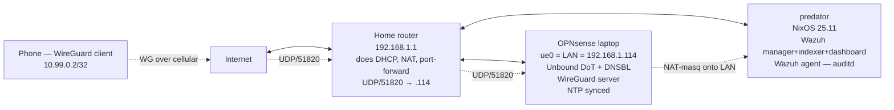

# Home-lab runbook

Operational reference for the predator + OPNsense LAN-host setup.
Future-you in 6 months: start here when something is broken.

## Topology



- OPNsense is **not** a gateway. It's a LAN-host service appliance. The home
  router does the actual NAT/firewall for everything.
- Predator's NixOS pulls DNS from OPNsense Unbound via systemd-resolved.
- Wazuh agents on OPNsense and predator report to the manager on predator.
- Remote access: phone → cellular → home WAN IP (75.180.104.157) → router
  port-forward → OPNsense WireGuard → LAN.

---

## Troubleshooting trees

### "DNS is broken on predator"

1. **Confirm scope.** Is it predator-only, or does OPNsense itself also fail?
   - On predator: `host cloudflare.com 127.0.0.53` — is systemd-resolved alive?
   - On OPNsense: `drill cloudflare.com @127.0.0.1` — is Unbound resolving?
2. **predator side fails, OPNsense side works** → systemd-resolved is the
   culprit. `resolvectl status` should show `Current DNS Server: 192.168.1.114`
   on enp2s0 OR globally. If not: `services.resolved.extraConfig` in
   `modules/networking.nix` is the source of truth. Rebuild + restart resolved.
3. **OPNsense side also fails** → the issue is upstream or the box itself.
   - `ssh opnsense ping -c2 9.9.9.9` — is upstream reachable? If "No route to
     host" but the WAN gateway is the home router: stale ARP. `ssh opnsense
     arp -d 192.168.1.1` and retry.
   - `ssh opnsense ntpq -4 -p 127.0.0.1` — peers showing reach 0? Clock may
     have drifted; DNSSEC signatures will look invalid. Fix clock first.
   - `ssh opnsense pgrep -lf '/usr/local/sbin/unbound -c /var/unbound/'` —
     OPNsense's Unbound running? If `/usr/local/etc/...` shows instead,
     someone ran `service unbound onerestart` — see [[opnsense-unbound-gotchas]].

### "WireGuard isn't connecting from cellular"

1. **Server up?** `ssh opnsense wg show` — does wg0 exist + listen on port 51820?
   - No: `ssh opnsense configctl wireguard restart` ... well, that doesn't write
     wg0.conf. See [[wireguard-home]] — manual `wg syncconf wg0
     /usr/local/etc/wireguard/wg0.conf` is the workaround.
2. **Port-forward live?** From an external network: `nmap -sU -p 51820
   75.180.104.157` — open means port-forward works. Closed means router
   isn't forwarding.
3. **Public IP rotated?** `dig +short <ddns-hostname>` matches `ssh opnsense
   fetch -qo - https://ifconfig.me`? If not, DDNS update lagged or the client
   has a stale endpoint cached.
4. **Handshake but no traffic?** Check NAT outbound rule:
   `ssh opnsense pfctl -s nat | grep 10.99`. Should show
   `nat on ue0 inet from 10.99.0.0/24 to any -> (ue0:0)`. Missing = no LAN
   reachability for peers.

### "Wazuh agent shows disconnected in dashboard"

1. **Manager up?** `ssh predator podman ps | grep wazuh-manager`. If not:
   `journalctl -u podman-wazuh-manager --since '10 min ago'`.
2. **Indexer up + ready?** `podman exec wazuh-manager
   curl -sk -u admin:<pw> https://wazuh-indexer:9200/_cluster/health`.
   Wait ~30s after start; indexer is slow to come up.
3. **Network reachability from agent host:**
   - OPNsense: `ssh opnsense nc -zv <predator-LAN-IP> 1514` — UDP/1514 must
     resolve to "succeeded".
   - predator's own agent: container-to-container on podman network "wazuh".
4. **Certs match?** Reset certs only if you fully understand it — re-running
   `wazuh-certs-tool.sh` invalidates the existing trust chain.

### "DoT to Quad9 broken — Unbound returning SERVFAIL"

1. `ssh opnsense cat /var/unbound/etc/dot.conf` — should have
   `forward-tls-upstream: yes` and `forward-addr: 9.9.9.9@853#dns.quad9.net`.
   If only `@853` without `#dns.quad9.net`: `<type>` in `<OPNsense><wireguard>...<dots>...<dot>`
   XML is `forward` not `dot`. Edit XML, `configctl unbound restart`.
2. `ssh opnsense tcpdump -i ue0 -nn -c5 'host 9.9.9.9'` should show TCP/853
   traffic. If still UDP/53: see step 1.
3. **OISD blocklist breaking validation?** Disable temporarily via XML:
   set `<dnsbl>` to empty element, restart unbound. If validation comes back,
   the issue is in the python DNSBL module.

---

## Update procedures

### OPNsense

- **DO NOT** auto-update. Plugin compatibility breaks subtly across major
  releases.
- Monthly cadence: log in, System → Firmware → Status, read the release notes
  *before* clicking "Update".
- Take a config backup (System → Configuration → Backups → "Download") right
  before pulling the trigger.
- After update: re-verify the Phase A+B+C checklist (DNS resolves with `ad`,
  WG handshake works, NTP synced).

### NixOS / predator

- Auto-builds weekly Sunday 04:00 (`system.autoUpgrade` in
  `modules/update-routines.nix`). Reboot is on you.
- Reboot to activate: `sudo systemctl reboot` after checking
  `nvd diff /run/booted-system /run/current-system` for surprises.
- Flake input bumps weekly Sunday 03:00 via the `flake-lock-update` timer.
  Manually `git diff flake.lock` after, commit if happy.

### Wazuh

- Version pinned in `modules/wazuh-manager.nix` (single `let` binding).
- Bump only when 4.X+1 ships and you've read the upstream migration notes.
- Containers re-pull on next `podman-wazuh-*.service` restart.

---

## Backup / restore

### OPNsense config

- Auto-backup destination: **TODO** (configure in System → Configuration →
  Backups → choose Nextcloud / SCP / Google Drive).
- Restore: System → Configuration → Backups → "Restore" → pick file.
  Reboots automatically.

### Wazuh data (indexer state)

- Live state in `/var/lib/wazuh-stack/{manager,indexer}` on predator.
- **TODO**: Restic backup of these paths to Backblaze B2 (Tier 3.3 in plan).

### Predator NixOS config

- Repo: <https://github.com/stoleyy/nixos-config>.
- `git push` to origin pushes the source of truth.
- `/etc/nixos` is a checkout; reinstall procedure pulls main and rebuilds.

---

## Password recovery

### OPNsense admin

- Boot OPNsense in single-user mode (select option from boot menu).
- `mount -uw /` then `pw usermod root -h 0` and re-set the password.

### Wazuh admin

- Stop the indexer container, edit `/var/lib/wazuh-stack/indexer/.../internal_users.yml`,
  reset the bcrypt hash. Documented at <https://documentation.wazuh.com/current/user-manual/user-administration/password-management.html>.

### sops age key

- Stored at `/var/lib/sops-nix/key.txt` on predator.
- **Back this up offline.** Losing it locks all sops-encrypted secrets out
  of the rebuild. Suggested: print, store in a fireproof safe.

---

## Useful commands

```
# DNS path verification
drill -D cloudflare.com @192.168.1.114      # AD flag = OPNsense validating
drill pagead2.googlesyndication.com @192.168.1.114  # NXDOMAIN = OISD blocking

# WG state
ssh opnsense wg show                         # peer handshakes, transfer counts
ssh opnsense sockstat -4 -l | grep 51820

# Wazuh state
ssh predator podman ps                       # all containers running
ssh predator podman logs --tail 50 wazuh-manager

# NTP sync
ssh opnsense ntpq -4 -p 127.0.0.1            # need * or + in selection column

# Routing sanity
ssh opnsense netstat -rn -f inet | head -5   # default → 192.168.1.1

# Audit events flowing
sudo journalctl -u audit --since '1 hour ago' | head
sudo ausearch -k identity --start recent      # auth-state changes
```

---

## Architecture quirks worth knowing

(See memory files for the full breakdown — this is the cliff-notes.)

- **OPNsense has ONE NIC** (USB ethernet `ue0`). Cannot be inline router/IPS.
- **OPNsense regenerates `/var/unbound/etc/`** on every `configctl unbound
  restart`. Durable Unbound config tweaks must go in
  `/usr/local/etc/unbound.opnsense.d/zz-*.conf` (survives regen) or via GUI.
- **Two unbound binaries exist** — never run `service unbound restart` on
  OPNsense; it kills the OPNsense-managed daemon. Always `configctl unbound restart`.
- **WireGuard wg0.conf isn't auto-written** by OPNsense's wg-service-control.php
  when the server entry was created via XML edit. Manual `wg syncconf` after
  template populates volatile fields.
- **/etc/nixos is the deploy point**, but the canonical source is the GitHub
  repo. Edits to `/etc/nixos` files are lost on next `git pull origin main`.
- **NixOS modules go in `lib/default.nix`**, not `flake.nix`.

---

## Steam: native Linux client is blocked — run the WINDOWS client under Wine

**Native Linux Steam (and the Flatpak) cannot run on `predator`.** Their CEF
`steamwebhelper` GPU process cannot initialise inside Valve's `steamrt`
pressure-vessel on this NixOS + NVIDIA host: `cef_log` `error_code=1002` →
"GPU process isn't usable"; kernel `trap int3 … in libcef.so`. Modern Steam
needs CEF even for its login window, so the Linux client never becomes
usable. Open upstream NixOS × pressure-vessel limitation —
NixOS/nixpkgs#485863, GNU Guix steam-runtime#480 — **no upstream fix exists**.

Exhaustively falsified on-box (do **not** retry): `hardware.nvidia.open=false`,
`MESA_GLSL/SHADER_CACHE_DISABLE` extraEnv, `-cef-disable-gpu` (ignored by the
build), `-cef-disable-sandbox`, `-no-cef-sandbox`, `-no-browser`, Steam Beta,
GLCache/htmlcache wipes, `VK_ICD_FILENAMES`/`VK_DRIVER_FILES` pin, **and the
Flatpak** (also runs `steamwebhelper` in the same `steamrt` pressure-vessel —
fails identically; does not escape the bug).

### Working solution: Windows `steam.exe` under Wine ✅ (verified on-box)

The bug is specific to Valve's **Linux** pressure-vessel CEF. The **Windows**
Steam client run under Wine uses Windows CEF translated straight onto the
NVIDIA driver — it never touches the Linux runtime, so its GPU process is
healthy and the full UI works (confirmed: live `--type=gpu-process` +
renderers, usable window).

```bash
# system wine (wineWowPackages.stable, already in modules/gaming.nix);
# default ~/.wine prefix; Windows Steam install lives on the old Windows
# NTFS "Vault" partition (/dev/sda2, automounted by the desktop):
wine "/run/media/stoleyy/Vault/Steam/steam.exe"
```

Add the Vault `steamapps` as a Steam library inside that client to see games.

**Caveats / durability (worth fixing later, not required to play):**
- Runs off NTFS (`/dev/sda2`) auto-mounted at `/run/media/stoleyy/Vault` by
  udisks — the mount is **not guaranteed at boot**; mount the drive (open it
  once in the file manager, or declare it by-UUID in
  `hosts/predator/default.nix` like the games/`/data` mounts) before
  launching, or `wine` will fail to find `steam.exe`.
- NTFS + Wine is poorer for a game library than a Linux FS. Durable setup:
  dedicated `WINEPREFIX` + library on a Linux filesystem.
- This is the standard escape hatch for the "Linux Steam CEF won't render"
  class of bug; revisit native Linux Steam only when nixpkgs#485863 is fixed
  upstream and proven on an on-box `nixos-rebuild test`.

### Also available for non-Steam games (host-native, unaffected)
- **Heroic** (`heroic`) — Epic / GOG / Amazon. **Lutris** (`lutris`) — GOG,
  Battle.net, DRM-free installers, emulators, any Wine/Proton title (uses
  installed `proton-ge-bin`, `gamemode`, MangoHud).

### Keepable wins from this investigation (independent of the Steam block)
- `3d9333a` `hardware.nvidia.open = false` — fixes the **separate**
  Plasma/SDDM-Wayland crash-loop (retest the Wayland session).
- `650aa91` removed a global `NIXOS_OZONE_WL` X11 leak (merged via PR #43).
- `programs.steam.enable = true` stays (vanilla) for system gaming plumbing
  reused by Wine-Steam/controllers: steam-hardware udev, Remote Play
  firewall, the nix-gaming sysctl bundle, gamescope.
